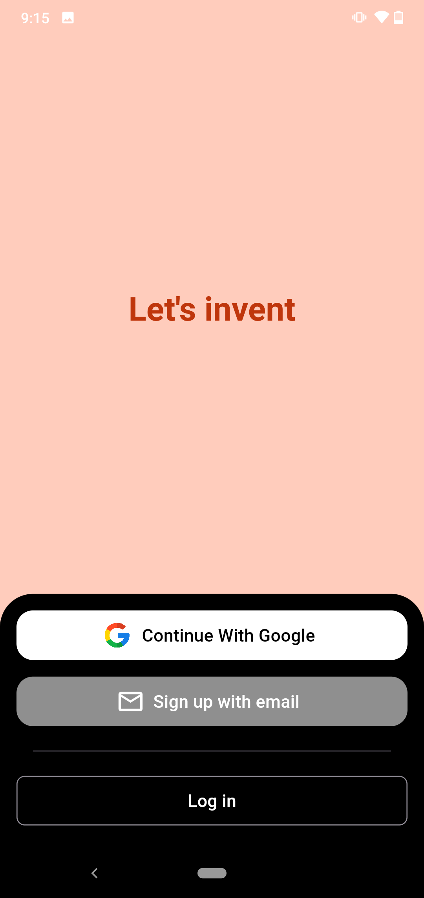
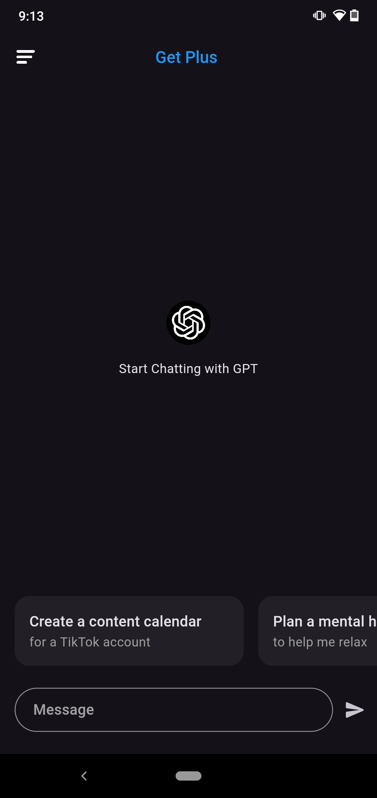
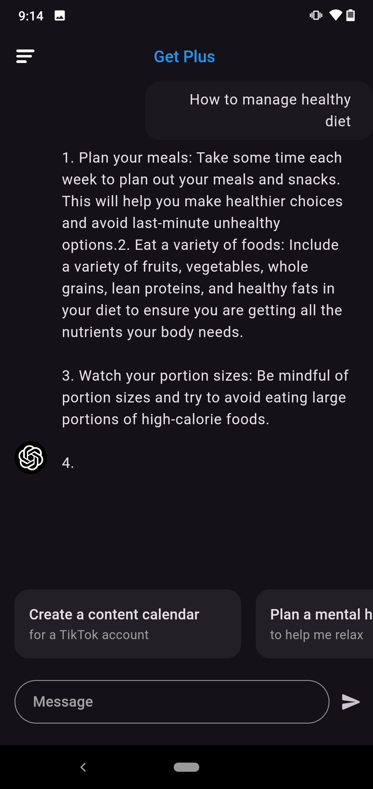
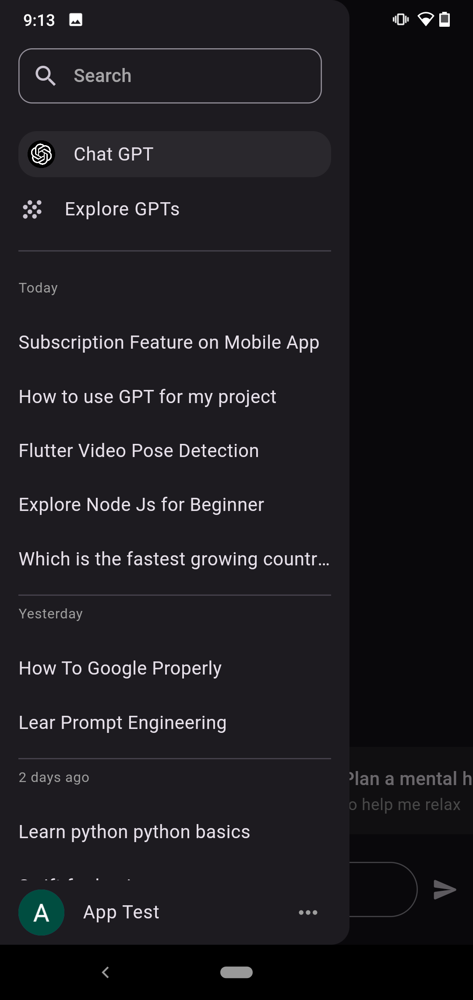

## Chat GPT Clone

This is a clone of the Chat GPT model by OpenAI. The model is trained on the Persona-Chat dataset

## How to run

1. Clone the repository
2. Run `flutter pub get` to install the dependencies
3. Add OPEN AI KEY in `lib/features/services/gpt_service.dart`
4. Run the app using `flutter run`

## Screenshots

## Login Page

## Home Screen
 

## Chat Screen
 

## Drawer
